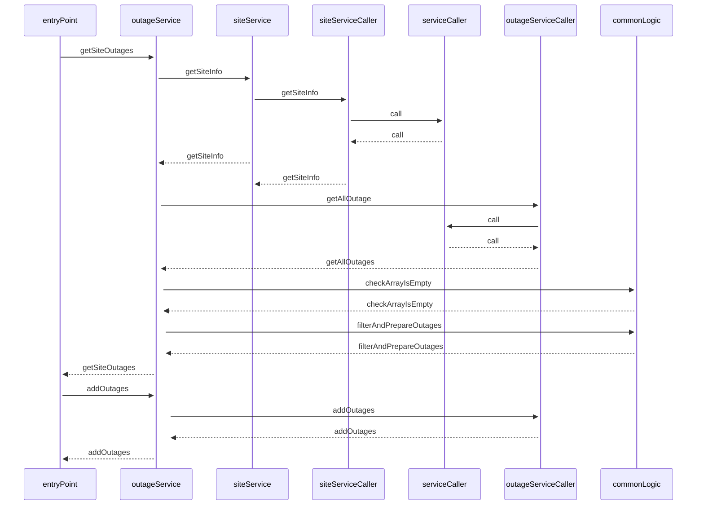

# krakenflex-backend-task

 This is small application which retrieve all outages for a site.

 Welcome. The whole structure is written in ts and the tsyringe library is used for dependcy injeciton. All classes and tests are written according to this principle. If API requests return an error as status code 500, the system tries it again for the specified time and number of repetitions. Eslint is used for code layout.

 See u !


## sequenceDiagram



## Installation

Install my-project with npm

```bash
  npm i
  cd krakenflex-backend-task
```
    
## Run Locally

Build

```bash
  npm run build
```

For running

```bash
  npm run start
```

Run dev

```bash
  npm run dev
```

Run test

```bash
  npm run test
```

## Environment Variables

To run this project, you will need to add the following environment variables to your .env file

| Variable | Type  | Decription   |
|--|--|--|
| RETRY_ATTEMPS | Number  | How many times will the system retry the request in case of an error? 
| RETRY_INTERVAL_MS | Number  | Waiting time in ms when the system repeats the request in case of an error
| FILTERING_LIMITED_DATE | String | To filter all outage records after the date |
| SPECIFIC_SITE_ID | String | To get outage data of a specific site  |
| KRAKEN_FLEX_API_KEY | String | x-api-key for sending token for sending request
| KRAKEN_FLEX_SERVICE_URL | String  | Kraken Flex Api Url

## Example Environment Variables

`RETRY_ATTEMPS` : 5

`RETRY_INTERVAL_MS` : 500

`KRAKEN_FLEX_API_KEY` : api-key

`KRAKEN_FLEX_SERVICE_URL` : service-url

`SPECIFIC_SITE_ID` : siteId

`FILTERING_LIMITED_DATE` : 2022-10-13T04:05:10.044Z


## Tech Stack

**Server:** Node, Express, Typescript , Dependcy Injection

